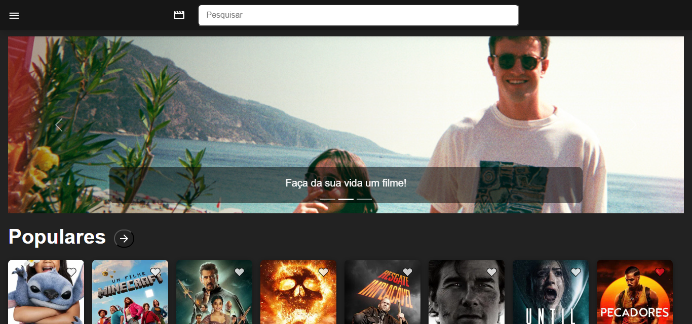
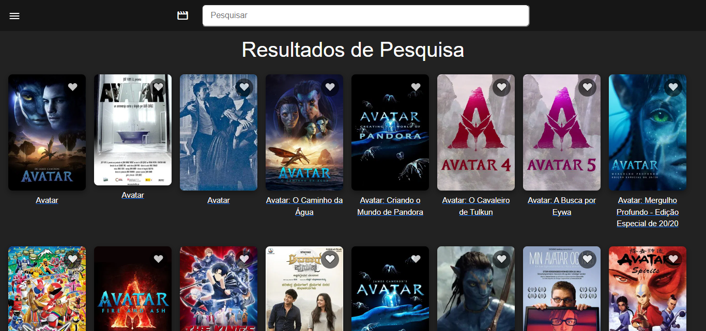
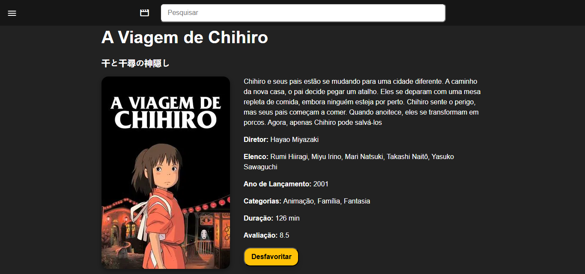
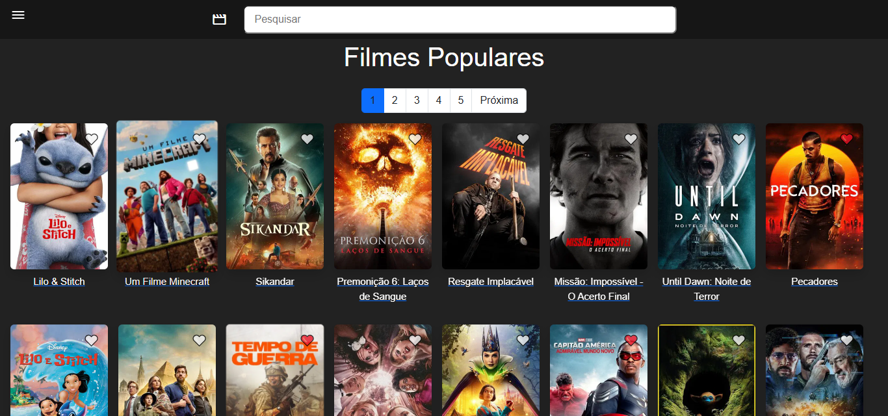
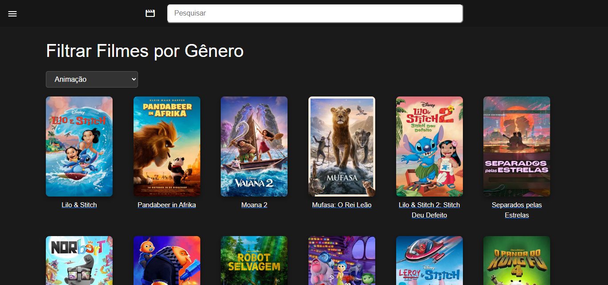
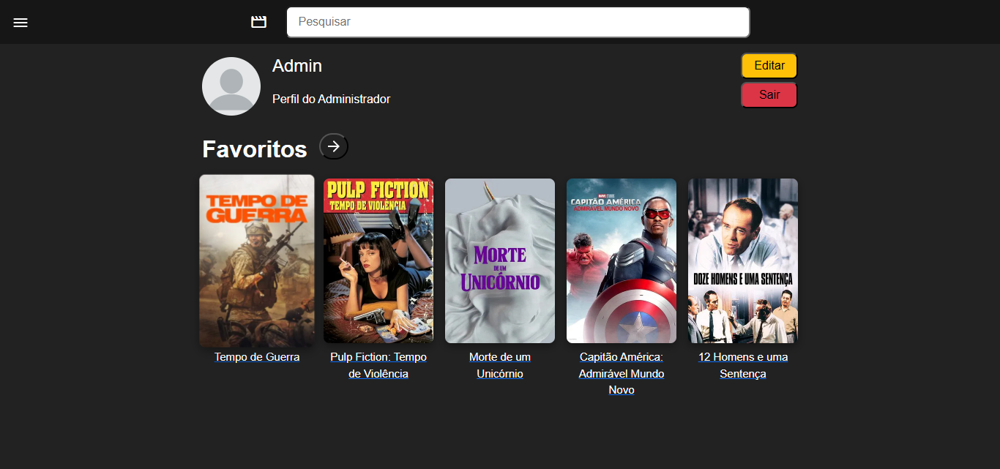
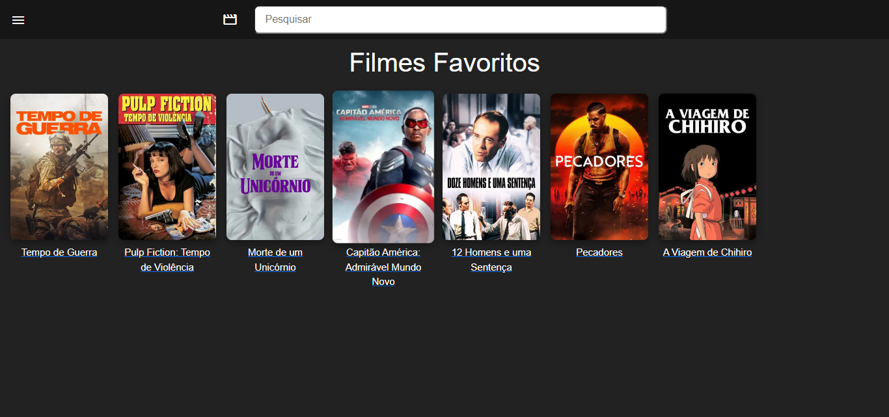
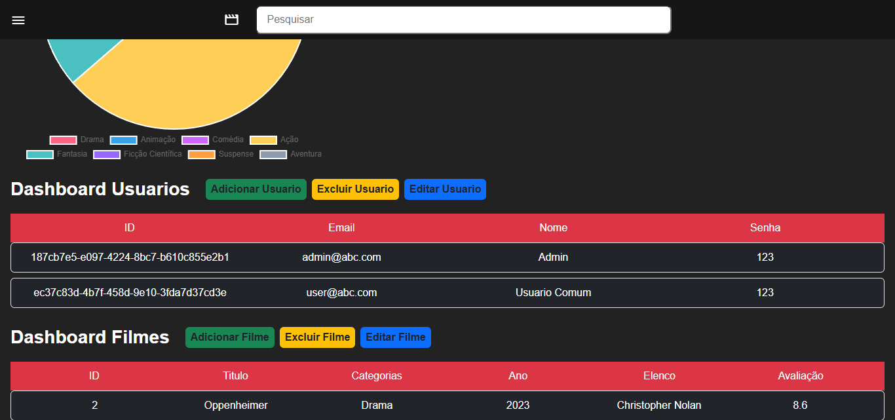

# 🎬 Catálogo de Filmes - Trabalho Prático

- **Autoria:** Maria Eduarda de Paula Brito  

## 📄 Descrição do Projeto

Este projeto é um **catálogo de filmes interativo** desenvolvido com **HTML, CSS e JavaScript**, utilizando o **JSON Server** como backend simulado por meio do arquivo `db.json`. A aplicação permite aos usuários navegar, pesquisar e favoritar filmes, além de interagir com diversas funcionalidades modernas de um sistema de catálogo digital.

## ✅ Funcionalidades

- Página Inicial com destaque para filmes e navegação intuitiva. 
- Autenticação de Usuário com login, senha e registro.
- Sistema de Favoritos para salvar filmes preferidos. 
- Pesquisa de Filmes por título ou categoria.
- Dashboard para Administrador, com funcionalidades de **CRUD** (Criar, Ler, Atualizar e Deletar).
- Visualização por **Gêneros e Categorias**, com páginas específicas  .
- Gráfico de Gêneros com dados visuais sobre a distribuição dos filmes.
- Perfil do Usuário com imagem e dados editáveis  
- Estrutura organizada com pastas separadas para **scripts**, **imagens** e **estilos**.


## 🔑 Acesso ao Site

O usuário só pode interagir com o site caso esteja logado. Pode usar uma das contas disponíveis abaixo ou criar uma nova:

### 👤 Contas de Acesso

- **Administrador:**  
  Email: `admin@abc.com`  
  Senha: `123`  
  **Acessar o Dashboard:** O dashboard só se torna disponível para a conta do administrador, mesmo que seja acessado diretamente pela URL:  
  `http://localhost:3000/dashboard.html`.

- **Usuário Comum:**  
  Email: `user@abc.com`  
  Senha: `123`

### 🚪 Deslogar da Conta Atual

Para sair da conta utilizada na sessão atual, o usuário deve ir até a seção de **perfil** e clicar no botão vermelho **"Sair"**.

---

## ⚙️ Requisitos para Rodar o Projeto Localmente

Para que o site funcione corretamente em um ambiente local de desenvolvimento, é necessário que algumas condições sejam atendidas.

### ✅ 1. Ter o Node.js Instalado

O Node.js é uma plataforma que permite executar JavaScript fora do navegador. Ele é essencial para rodar o servidor de desenvolvimento e instalar dependências do projeto.

- Faça o download da versão LTS em:  
  [https://nodejs.org/](https://nodejs.org/)

- Após instalar, verifique se tudo está funcionando com os comandos no terminal:

```bash
node -v
npm -v
```

---

### ✅ 2. Ter o npm (Node Package Manager)

O `npm` geralmente é instalado junto com o Node.js. Ele é responsável por instalar e gerenciar os pacotes (dependências) do projeto.

---

### ✅ 3. Instalar as Dependências do Projeto

Após baixar ou clonar o projeto, abra o terminal na pasta do projeto e execute:

```bash
npm install
```

Esse comando irá instalar todas as bibliotecas necessárias que estão listadas no arquivo `package.json`.

---

### ✅ 4. Rodar o Projeto com `npm start`

Depois de instalar as dependências, inicie o projeto com:

```bash
npm start
```

Esse comando executará o servidor local e abrirá o site no navegador, geralmente em:

```
http://localhost:3000
```

---

Se você precisar de ajuda para configurar o ambiente ou personalizar o comportamento de acesso com base no tipo de usuário, entre em contato com a equipe de desenvolvimento ou consulte a documentação do projeto.

## 📷 Prints da Tela com a Implementação

### Página Inicial - *index.html*



### Página de Resultados de Pesquisa - *resultados.html*



### Página de Detalhamento - *detalhes.html*



### Página de Categorias - *categoria.html*



### Página de Filtro por Gênero - *generos.html*



### Página de Perfil - *perfil.html*



### Página de Favoritos - *favoritos.html*



### Página de Dashboard Admin - *dashboard.html*


